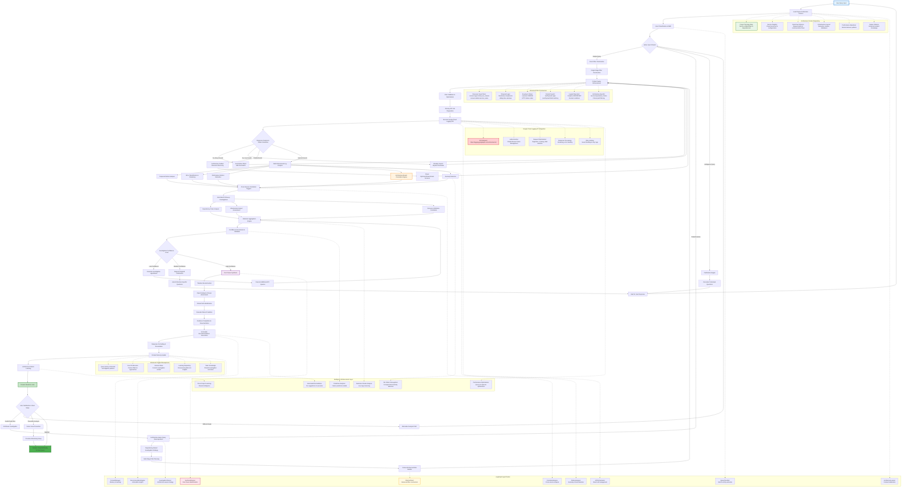

# Advanced Log Analysis Agent Architecture

## Mermaid Diagram

```mermaid
graph TD
    A[User Query Input] --> A1[Load Project Architecture Context]
    A1 --> B[Intent Classification & NER]
    B --> C{Query Type Analysis}
    
    C -->|Simple Query| D[Direct Filter Construction]
    C -->|Complex Query| E[Architecture-Aware Query Decomposition]
    C -->|Ambiguous Query| F[Clarification Engine]
    
    F --> G[Generate Contextual Questions]
    G --> H[Wait for User Response]
    H --> A
    
    E --> J[Dependency-Based Investigation Strategy]
    J --> K[Multi-Stage Filter Planning]
    K --> L[Context-Enhanced Filter Builder]
    
    D --> M[Single-Stage Filter Construction]
    M --> N[Context-Aware Enhancement]
    L --> N
    
    N --> O[Filter Validation & Optimization]
    O --> P[Primary API Call Preparation]
    P --> Q[Execute Google Cloud Logging API]
    
    Q --> R{Response Analysis & Pattern Detection}
    
    R -->|Too Many Results| S[Auto-Refine Filters<br/>Add Constraints]
    R -->|Too Few Results| T[Broaden Search<br/>Expand Timeframe]
    R -->|Empty Results| U[Architecture-Guided Resource Discovery]
    R -->|Optimal Results| V[Multi-Dimensional Log Analysis]
    
    S --> N
    T --> N
    U --> U1[Check Upstream/Downstream Services]
    U1 --> N
    
    V --> V1[Temporal Pattern Analysis]
    V --> V2[Error Classification & Clustering]
    V --> V3[Performance Metrics Extraction]
    V --> V4[Architecture-Based Correlation Engine]
    V --> V5[Anomaly Detection]
    
    V1 --> W[Cross-Service Correlation Triggers]
    V2 --> W
    V3 --> W
    V4 --> W
    V5 --> W
    
    W --> X[Automated Follow-up Investigations]
    X --> X1[Dependency Chain Analysis]
    X --> X2[Infrastructure Impact Assessment]
    X --> X3[Resource Utilization Correlation]
    
    X1 --> Y[Evidence Aggregation Engine]
    X2 --> Y
    X3 --> Y
    
    Y --> Z[Confidence Assessment & Validation]
    Z --> AA{Investigation Confidence Level}
    
    AA -->|Low Confidence| BB[Generate Investigative Hypotheses]
    AA -->|Medium Confidence| CC[Request Targeted Clarification]
    AA -->|High Confidence| DD[Root Cause Synthesis]
    
    BB --> EE[Execute Additional API Queries]
    EE --> Y
    
    CC --> FF[Ask Architecture-Specific Questions]
    FF --> H
    
    DD --> GG[Timeline Reconstruction]
    GG --> HH[Impact Analysis & Scope Assessment]
    HH --> II[Critical Path Identification]
    II --> JJ[Cascade Failure Prediction]
    
    JJ --> KK[Evidence Compilation & Documentation]
    KK --> LL[Actionable Recommendations Generation]
    LL --> MM[Response Formatting & Presentation]
    
    MM --> NN[Context Memory Update]
    NN --> OO[Architecture Pattern Learning]
    OO --> PP[Present Results to User]
    
    PP --> QQ{User Satisfaction & Next Steps}
    QQ -->|Needs Deep Dive| RR[Drill-Down Investigation]
    QQ -->|Different Angle| SS[Alternative Analysis Path]
    QQ -->|Preventive Analysis| TT[Future Issue Prevention]
    QQ -->|Satisfied| UU[Session Complete/Ready for Next Query]
    
    RR --> E
    SS --> C
    TT --> VV[Proactive Monitoring Setup]
    VV --> UU
    
    subgraph "Architecture Context Repository"
        WW[Project Topology Map:<br/>Service relationships & dependencies]
        XX[Service Registry:<br/>Cloud resources & configurations]
        YY[Data Flow Patterns:<br/>Request paths & communication flows]
        ZZ[Infrastructure Layout:<br/>Networks, clusters, databases]
        AAA[Performance Baselines:<br/>Normal behavior patterns]
        BBB[Failure Patterns:<br/>Historical incident knowledge]
    end
    
    subgraph "Enhanced Context Management"
        CCC[Query History & Results:<br/>Investigation patterns]
        DDD[User Preferences:<br/>Custom filters & approaches]
        EEE[Session State:<br/>Current investigation context]
        FFF[Learning Repository:<br/>Discovered patterns & insights]
        GGG[Team Knowledge:<br/>Shared investigation outcomes]
    end
    
    subgraph "Advanced Filter Construction"
        HHH["Resource Type Filters:<br/>resource.type=cloud_run_revision<br/>resource.labels.service_name"]
        III["Temporal Logic:<br/>timestamp comparisons<br/>sliding time windows"]
        JJJ["Severity & Status:<br/>severity>=ERROR<br/>HTTP status codes"]
        KKK["Content Search:<br/>textPayload regex<br/>jsonPayload field matching"]
        LLL["Logical Operators:<br/>Complex AND/OR/NOT<br/>Nested conditions"]
        MMM["Architecture-Specific:<br/>Service dependency chains<br/>Critical path filtering"]
    end
    
    subgraph "LangGraph Agent Nodes"
        NNN[ArchitectureLoader:<br/>Context initialization]
        OOO[QueryClassifier:<br/>Intent & entity extraction]
        PPP[InvestigationPlanner:<br/>Architecture-aware strategy]
        QQQ[FilterArchitect:<br/>Advanced filter construction]
        RRR[APIOrchestrator:<br/>Smart call management]
        SSS[CorrelationEngine:<br/>Cross-service analysis]
        TTT[PatternAnalyzer:<br/>Anomaly & trend detection]
        UUU[SynthesisEngine:<br/>Root cause determination]
        VVV[RecommendationEngine:<br/>Actionable insights]
        WWW[ContextManager:<br/>Memory & learning]
    end
    
    subgraph "Google Cloud Logging API Integration"
        XXX["API Endpoint:<br/>https://logging.googleapis.com/v2/entries:list"]
        YYY["Authentication:<br/>OAuth2 Bearer Token Management"]
        ZZZ["Request Optimization:<br/>Pagination, ordering, field selection"]
        AAAA["Response Processing:<br/>Streaming, error handling"]
        BBBB["Rate Limiting:<br/>Smart throttling & retry logic"]
    end
    
    subgraph "Intelligence Enhancement Layer"
        CCCC[Real-time Stream Analysis:<br/>Live log processing]
        DDDD[Predictive Analytics:<br/>Failure prediction models]
        EEEE[ML Pattern Recognition:<br/>Unsupervised anomaly detection]
        FFFF[Cross-Project Learning:<br/>Shared intelligence]
        GGGG[Automated Remediation:<br/>Fix suggestions & execution]
        HHHH[Performance Optimization:<br/>Query & response optimization]
    end
    
    A1 -.-> WW
    A1 -.-> XX
    A1 -.-> YY
    A1 -.-> ZZ
    A1 -.-> AAA
    A1 -.-> BBB
    
    NN -.-> CCC
    NN -.-> DDD
    NN -.-> EEE
    NN -.-> FFF
    NN -.-> GGG
    
    N -.-> HHH
    N -.-> III
    N -.-> JJJ
    N -.-> KKK
    N -.-> LLL
    N -.-> MMM
    
    A1 -.-> NNN
    B -.-> OOO
    E -.-> PPP
    L -.-> QQQ
    Q -.-> RRR
    W -.-> SSS
    V -.-> TTT
    DD -.-> UUU
    LL -.-> VVV
    NN -.-> WWW
    
    Q -.-> XXX
    Q -.-> YYY
    Q -.-> ZZZ
    Q -.-> AAAA
    Q -.-> BBBB
    
    Y -.-> CCCC
    Z -.-> DDDD
    V5 -.-> EEEE
    OO -.-> FFFF
    LL -.-> GGGG
    Q -.-> HHHH
    
    style A fill:#e3f2fd,stroke:#1976d2,stroke-width:3px
    style PP fill:#c8e6c9,stroke:#388e3c,stroke-width:3px
    style UU fill:#4caf50,stroke:#2e7d32,stroke-width:3px
    style DD fill:#f3e5f5,stroke:#7b1fa2,stroke-width:2px
    style V4 fill:#fff3e0,stroke:#f57c00,stroke-width:2px
    style XXX fill:#ffcdd2,stroke:#d32f2f,stroke-width:2px
    style WW fill:#e8f5e8,stroke:#2e7d32,stroke-width:2px
    style QQQ fill:#fff8e1,stroke:#f9a825,stroke-width:2px
    style UUU fill:#fce4ec,stroke:#c2185b,stroke-width:2px
```
